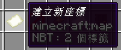

# 指令操作

目前指令有分為以下幾種:

* [`/loc`](commands.md#zhi-ling-loc)
* [`/loc create`](commands.md#zhi-ling-loc-create)
* [`/loc remove`](commands.md#command-loc-remove)
* [`/loc search`](commands.md#command-loc-search)
* [`/loc list`](commands.md#command-loc-list)
* [`/loc <player>`](commands.md#command-loc-player)

### 指令  `/loc` 

<figure><figcaption>
AllInOne 插件之選單
</figcaption></figure>

當您使用 `/loc` 指令的時候，將會開啟 AllInOne 插件的選單。選單裡包含了 AllInOne 部分的功能，功能為:

*   [建立座標](commands.md#zhi-ling-loc-create)

    

    <figure><figcaption></figcaption></figure>

    

*   [刪除座標](commands.md#command-loc-remove)

    

    <figure><figcaption></figcaption></figure>

    

*   [查詢座標](commands.md#command-loc-search)

    

    <figure><figcaption></figcaption></figure>

    

*   [所有座標](commands.md#command-loc-list)

    

    <figure><figcaption></figcaption></figure>

    

*   與 離開選單

    

    <figure><figcaption></figcaption></figure>

    

### 指令 `/loc create` 

<figure><figcaption>
創建座標選單
</figcaption></figure>

您可以使用 `/loc create` 或是從[插件選單](commands.md#command-loc)裡開啟這個選單。在此選單中，您可以設定該座標點的名稱，您設定的地點將會公開顯示於伺服器中。


\[給伺服器管理員的話] 座標點會儲存於 `<伺服器根目錄>/plugins/AllInOne/database.db` 之中，若您需要移轉伺服器，請將該檔案放置於新伺服器的相同位置。為了避免座標點資料遺失，請一同備份該檔案。


這個選單與鐵砧的介面相同，您只需要修改「新地點」之名稱即可，在確認改為合適的名稱後，您只需要按下右邊的即可儲存於伺服器中。

### 指令 `/loc remove` 

<figure><figcaption>
移除座標選單
</figcaption></figure>

您可以使用 `/loc remove`或是從[插件選單](commands.md#command-loc)裡開啟這個選單。在創建多個座標後，難免的會創建錯誤、重複或是名稱不適宜的座標點，那麼這時您即可使用這個刪除選單來刪除**您所創建的座標點**。


您只能刪除您自己創建的座標點


#### 座標刪除步驟 


請注意！若您刪除座標點，則該點將無法復原。


若您希望刪除座標，您可以將滑鼠移動至您想要刪除的座標點之上，會出現如下圖的提示，這時您只需要按下您設定的左鍵。

<figure><figcaption>
物件提示
</figcaption></figure>

接著，系統會於聊天框提示您是否要刪除該座標點，如下圖:

<figure><figcaption>
刪除提示
</figcaption></figure>

若您認為您選擇了錯誤的座標點，您可以忽視該訊息，確認通知會於一分鐘內自動拒絕，並且會提示您訊息。

<figure><figcaption>
超時取取消
</figcaption></figure>

相反的，若您按下，則該座標點會被刪除。若刪除成功，將會提示你座標刪除成功。

### 指令 `/loc search` 

<figure><figcaption>
查詢座標點選單
</figcaption></figure>


AllInOne 插件使用SQL的 `LIKE` 進行關鍵字的搜尋，因此僅能搜尋「相同名稱」的座標點。


您可以使用 `/loc search`或是從[插件選單](commands.md#command-loc)裡開啟這個選單。若您想找尋特定名稱的座標點，您可以使用查詢座標點選單。

這個選單會自動搜尋所有名稱相符的座標點，並且會將結果顯示於[所有座標點選單](commands.md#command-loc-list)之中。此選單與創建座標點選單相同使用鐵砧選單。您只需要將您想要搜尋之座標點名稱輸入於「輸入查詢的地點」，並按下右邊的.png>)即可查詢座標點。

### 指令 `/loc list` 

<figure><figcaption>
所有座標點選單
</figcaption></figure>

您可以使用 `/loc list`或是從[插件選單](commands.md#command-loc)裡開啟這個選單。在此選單中，您可以選擇地點傳送，或是將地點座標顯示於聊天室當中。

#### 座標點傳送 


為了避免影響原版遊戲體驗，AllInOne 插件預設一天僅提供三次的傳送機會。您可以於下方之「終界珍珠」查看。如圖所示

.png>)


您可以直接傳送到該地點，只需要按下您所設定的左鍵即可進行傳送。

#### 顯示於聊天室 

若您以達傳送次數上限或是您不想浪費傳送次數，您可以使用此方法來前往目的地。使用您所設定之右鍵即可將訊息顯示於聊天室中。

系統會會於聊天室中顯示類似於以下訊息之提示。

<figure><figcaption>
座標提示
</figcaption></figure>

### 指令 `/loc <player>` 

您可以使用此指令來向其他玩家發送傳送請求。您所要求傳送之玩家會收到如以下之傳送訊息。

<figure><figcaption>
傳送訊息
</figcaption></figure>

該玩家可以選擇允許或是拒絕請求。在該玩家操作當下，您即會收到他的答覆。


請求會於一分鐘內自動被拒絕。若您被拒絕，您還是可以發送傳送請求。

